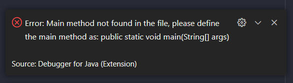

# Week 02 - JOBSHEET 2 - OBJECT 

**Nama :** Mohammad Adri Favian<br>
**NIM :** 2341720185<br>
**Kelas :** TI-1B<br>
**Absen :** 18

## Praktikum

### Percobaan 1: Deklarasi Class, Atribut dan Method
membuat class beserta atribut dan method yang dimilikinya.
</br>
Code:

```
public class Buku18 {
    
    String judul, pengarang;
    int halaman, stok, harga;
    
    void tampilInformasi() {
        System.out.println("Judul: " + judul);
        System.out.println("Pengarang: " + pengarang); 
        System.out.println("Jumlah halaman: " + halaman); 
        System.out.println("Sisa stok: " + stok); 
        System.out.println("Harga: " + harga); 
    }

    void terjual(int jml) {
        stok -= jml;
    }

    void restock(int jml) {
        stok += jml;
    }

    void gantiHarga(int hrg) {
        harga = hrg;
    }
}
```
#### 2.1.2 Verifikasi Hasil Percobaan



#### 2.1.3 Pertanyaan

1. Sebutkan dua karakteristik class atau object!
2. Perhatikan class Buku pada Praktikum 1 tersebut, ada berapa atribut yang dimiliki oleh class
Buku? Sebutkan apa saja atributnya!
3. Ada berapa method yang dimiliki oleh class tersebut? Sebutkan apa saja methodnya!
4. Perhatikan method terjual() yang terdapat di dalam class Buku. Modifikasi isi method tersebut
sehingga proses pengurangan hanya dapat dilakukan jika stok masih ada (lebih besar dari 0)!
5. Menurut Anda, mengapa method restock() mempunyai satu parameter berupa bilangan int?

#### 2.1.4 Jawaban

1.

- Encapsulation: menggabungkan data dan method menjadi satu kesatuan

- Inheritance: memungkinkan untuk reuse code dan mempermudah pemograman yang kompleks

2.  ada 5:

    - judul: String

    - pengarang: String

    - halaman: int

    - stok: int

    - harga: int

3. ada 4:

    - tampilInformasi(): void

    - terjual(jml: int): void

    - restock(n: int): void

    - gantiHarga(hrg: int): int

4.
```
  void terjual(int jml, String judul) {
        if (stok > 0) {
        stok-=jml;
        } else {
        System.out.println("Stok buku " + judul + " sudah habis!");
        }
    }
```

5. method `restock()` mempunyai satu paramater berupa bilangan `int`, dikarenakan restock adalah aktifitas untuk menambahkan stock barang, dimana barang tesebut diwakilkan oleh jumlah yang biasanya memakai tipe data `int`.


### Percobaan 2: Instansiasi Object, serta Mengakses Atribut dan Method

Code:
```
public class BukuMain18 {
    public static void main(String[] args) {
        Buku18 bk1 = new Buku18();
        bk1.judul = "Today Ends Tomorrow Comes";
        bk1.pengarang = "Denanda Pratiwi";
        bk1.halaman = 198;
        bk1.stok = 13;
        bk1.harga = 71000;

        bk1.tampilInformasi();
        bk1.terjual(5, bk1.judul);
        bk1.gantiHarga (60000);
        bk1.tampilInformasi();
    }
}
```

#### 2.2.2 Verifikasi Hasil Percobaan


#### 2.2.3 Pertanyaan

1. Pada class `BukuMain`, tunjukkan baris kode program yang digunakan untuk proses instansiasi!
Apa nama object yang dihasilkan?
2. Bagaimana cara mengakses atribut dan method dari suatu objek?
3. Mengapa hasil output pemanggilan method `tampilInformasi()` pertama dan kedua berbeda?

#### 2.2.4 Jawaban

1. baris kode program yang digunakan untuk proses instansiasi:
```Buku18 bk1 = new Buku18();```
nama object yang dihasilkan: `bk1`

2. menggunakan metode `notasi titik`
seperti pada contoh: `bk1.tampilInformasi();`