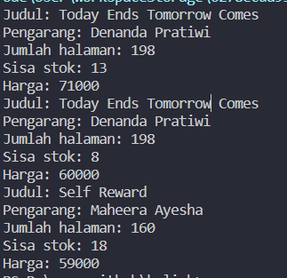
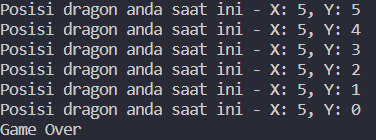

# Week 02 - JOBSHEET 2 - OBJECT 

**Nama :** Mohammad Adri Favian<br>
**NIM :** 2341720185<br>
**Kelas :** TI-1B<br>
**Absen :** 18

## Praktikum

### Percobaan 1: Deklarasi Class, Atribut dan Method
membuat class beserta atribut dan method yang dimilikinya.
</br>
Code:

```java
public class Buku18 {
    
    String judul, pengarang;
    int halaman, stok, harga;
    
    void tampilInformasi() {
        System.out.println("Judul: " + judul);
        System.out.println("Pengarang: " + pengarang); 
        System.out.println("Jumlah halaman: " + halaman); 
        System.out.println("Sisa stok: " + stok); 
        System.out.println("Harga: " + harga); 
    }

    void terjual(int jml) {
        stok -= jml;
    }

    void restock(int jml) {
        stok += jml;
    }

    void gantiHarga(int hrg) {
        harga = hrg;
    }
}
```
#### 2.1.2 Verifikasi Hasil Percobaan


#### 2.1.3 Pertanyaan

1. Sebutkan dua karakteristik class atau object!
2. Perhatikan class Buku pada Praktikum 1 tersebut, ada berapa atribut yang dimiliki oleh class
Buku? Sebutkan apa saja atributnya!
3. Ada berapa method yang dimiliki oleh class tersebut? Sebutkan apa saja methodnya!
4. Perhatikan method terjual() yang terdapat di dalam class Buku. Modifikasi isi method tersebut
sehingga proses pengurangan hanya dapat dilakukan jika stok masih ada (lebih besar dari 0)!
5. Menurut Anda, mengapa method restock() mempunyai satu parameter berupa bilangan int?

#### 2.1.4 Jawaban

1.

- Encapsulation: menggabungkan data dan method menjadi satu kesatuan

- Inheritance: memungkinkan untuk reuse code dan mempermudah pemograman yang kompleks

2.  ada 5:

    - judul: String

    - pengarang: String

    - halaman: int

    - stok: int

    - harga: int

3. ada 4:

    - tampilInformasi(): void

    - terjual(jml: int): void

    - restock(n: int): void

    - gantiHarga(hrg: int): int

4.
```java
  void terjual(int jml, String judul) {
        if (stok > 0) {
        stok-=jml;
        } else {
        System.out.println("Stok buku " + judul + " sudah habis!");
        }
    }
```

5. method `restock()` mempunyai satu paramater berupa bilangan `int`, dikarenakan restock adalah aktifitas untuk menambahkan stock barang, dimana barang tesebut diwakilkan oleh jumlah yang biasanya memakai tipe data `int`.

##
### Percobaan 2: Instansiasi Object, serta Mengakses Atribut dan Method

Code:
```java
public class BukuMain18 {
    public static void main(String[] args) {
        Buku18 bk1 = new Buku18();
        bk1.judul = "Today Ends Tomorrow Comes";
        bk1.pengarang = "Denanda Pratiwi";
        bk1.halaman = 198;
        bk1.stok = 13;
        bk1.harga = 71000;

        bk1.tampilInformasi();
        bk1.terjual(5, bk1.judul);
        bk1.gantiHarga (60000);
        bk1.tampilInformasi();
    }
}
```

#### 2.2.2 Verifikasi Hasil Percobaan


#### 2.2.3 Pertanyaan

1. Pada class `BukuMain`, tunjukkan baris kode program yang digunakan untuk proses instansiasi!
Apa nama object yang dihasilkan?
2. Bagaimana cara mengakses atribut dan method dari suatu objek?
3. Mengapa hasil output pemanggilan method `tampilInformasi()` pertama dan kedua berbeda?

#### 2.2.4 Jawaban

1. baris kode program yang digunakan untuk proses instansiasi:
```java
Buku18 bk1 = new Buku18();
```
nama object yang dihasilkan: `bk1`

2. menggunakan metode "notasi titik"
seperti pada contoh: `bk1.tampilInformasi();`

3. dikarenakan setelah method `tampilInformasi()` yang pertama dijalankan, ada method `bk1.terjual()` dan `bk1.gantiHarga ()` 
yang dimana method tersebut merubah data dari stok dan harga dari objek tersebut, sehingga saat method `tampilInformasi()` yang kedua di jalankan, akan menghasilkan output yang berbeda.

##
### Percobaan 3: Membuat Konstruktor

Code:
```java
public class BukuMain18 {
    public static void main(String[] args) {
        Buku18 bk1 = new Buku18();
        bk1.judul = "Today Ends Tomorrow Comes";
        bk1.pengarang = "Denanda Pratiwi";
        bk1.halaman = 198;
        bk1.stok = 13;
        bk1.harga = 71000;

        bk1.tampilInformasi();
        bk1.terjual(5, bk1.judul);
        bk1.gantiHarga (60000);
        bk1.tampilInformasi();

        Buku18 bk2 = new Buku18 ("Self Reward", "Maheera Ayesha", 160, 29, 59000);
        bk2.terjual(11, bk2.judul);
        bk2.tampilInformasi();
    }
}
```

#### 2.3.2 Verifikasi Hasil Percobaan



#### 2.3.3 Pertanyaan

1. Pada class `Buku` di Percobaan 3, tunjukkan baris kode program yang digunakan untuk mendeklarasikan konstruktor berparameter!
2. Perhatikan class `BukuMain`. Apa sebenarnya yang dilakukan pada baris program berikut?
    ```java 
    Buku bk2 = new Buku ("Self Reward", "Maheera Ayesha", 160, 29, 59000);
    ```
3. Hapus konstruktor default pada class `Buku`, kemudian compile dan run program. Bagaimana hasilnya? Jelaskan mengapa hasilnya demikian!
4. Setelah melakukan instansiasi object, apakah method di dalam class `Buku` harus diakses secara berurutan? Jelaskan alasannya!
5. Buat object baru dengan nama `buku<NamaMahasiswa>` menggunakan konstruktor berparameter dari class `Buku`!

#### 2.3.4 Jawaban

1. baris kode program yang digunakan untuk mendeklarasikan konstruktor berparameter adalah: 
    ```java 
    Buku bk2 = new Buku ("Self Reward", "Maheera Ayesha", 160, 29, 59000);
    ```
2. baris kode program tersebut sedang mendeklarasikan konstruktor berparameter, paramater tersebut menampung nilai baru yang diisikan ke setiap atribut.

3. error, dan tidak dapat dijalankan. Dikarenakan baris kode tersebut adalah konstruktor default yang diperlukan jika kita memiliki objek yang tidak diberi nilai awal untuk semua atributnya.

4. tidak, dikarenakan method yang berada dalam class Buku bersifat indenpenden atau dapat dipanggil satu-persatu
5. 
```java
Buku18 bukuAdri = new Buku18 ("cara cepat menjadi milioner dalam 1 detik", "Mohammad Adri Favian", 3, 18, 10000);
bukuAdri.tampilInformasi();
```

##
### 2.4 Latihan Praktikum
1. Menambahkan tiga method yaitu `hitungHargaTotal()`, `hitungDiskon()`, dan `hitungHargaBayar()` dengan spesifikasi yang telah dijelaskan, juga menyesuikan dengan class diagram yang diberikan.  

Full code `Buku.java`:
```java
    public class Buku18 {
    
    String judul, pengarang;
    int halaman, stok, harga, terjual;

    public Buku18() {
        //default constructor
    }

    public Buku18 (String jud, String pg, int hal, int stok, int har) {
        judul = jud;
        pengarang = pg;
        halaman = hal;
        this.stok = stok;
        harga = har;
    }
    
    void tampilInformasi() {
        System.out.println("Judul: " + judul);
        System.out.println("Pengarang: " + pengarang); 
        System.out.println("Jumlah halaman: " + halaman); 
        System.out.println("Sisa stok: " + stok); 
        System.out.println("Harga: " + harga); 
        System.out.println("Harga total: " + hitungHargaTotal());
        System.out.println("Diskon: " + hitungDiskon());
        System.out.println("Harga bayar: " + hitungHargaBayar());
    }

    void terjual(int jml, String judul) {
        if (stok > 0) {
        stok-=jml;
        } else {
        System.out.println("Stok buku " + judul + " sudah habis!");
        }
    }
    
    void restock(int jml) {
        stok += jml;
    }

    void gantiHarga(int hrg) {
        harga = hrg;
    }

    int hitungHargaTotal() {
        return harga * terjual;
    }

    int hitungDiskon() {
        int hargaTotal = hitungHargaTotal();
        if (hargaTotal > 150000) {
            return (int) (hargaTotal * 0.12);
        } else if (hargaTotal == 75000 || hargaTotal == 150000) {
            return (int) (hargaTotal * 0.05);
        } else {
            return 0;
        }
    }
    
    int hitungHargaBayar() {
        int hargaTotal = hitungHargaTotal();
        int diskon = hitungDiskon();
        return hargaTotal - diskon;
    }    
}
```

2. Membuat program berdasarkan class diagram berikut!

    | Dragon |
    |---|
    | x: int <br> y: int <br> width: int <br> height: int |
    | moveLeft(): void <br> moevRight(): void <br> moveUp(): void <br> moveDown(): void <br> printPosition(): void <br> detectCollision(x: int, y: int): void <br> 

Full code `Dragon.java`:
```java
public class Dragon {
    int x, y; // koordinat posisi 
    int width, height; // dimensi area permainan

    // Constructor untuk inisialisasi dragon
    public Dragon(int x, int y, int gameWidth, int gameHeight) {
        this.x = x;
        this.y = y;
        width = gameWidth;
        height = gameHeight;
    }

    public void moveLeft() {
        if (x > 0) {
            x--;
            printPosition();
        } else {
            detectCollision(x, y);
        }
    }

    public void moveRight() {
        if (x < width) {
            x++;
            printPosition();
        } else {
            detectCollision(x, y);
        }
    }
    
    public void moveUp() {
        if (y > 0) {
            y--;
            printPosition();
        } else {
            detectCollision(x, y);
        }
    }
    
    public void moveDown() {
        if (y < height) {
            y++;
            printPosition();
        } else {
            detectCollision(x, y);
        }
    }

    public void printPosition() {
        System.out.println("Posisi dragon anda saat ini - X: " + x + ", Y: " + y);
    }

    public void detectCollision(int x, int y) {
        System.out.println("Game Over");
    }

    public static void main(String[] args) {
        Dragon dragon = new Dragon(5, 5, 10, 10);

        dragon.printPosition();
        dragon.moveUp();
        dragon.moveUp();
        dragon.moveUp();
        dragon.moveUp();
        dragon.moveUp();
        dragon.moveUp();
    }
}
```

Hasil program setelah ***dragon*** di posisikan keluar dari arena agar game over:




