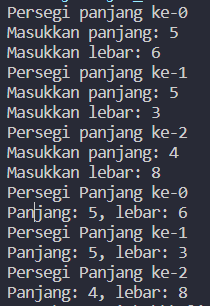
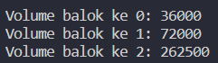

# Week 01 - JOBSHEET 3 - ARRAY OF OBJECT

**Nama :** Mohammad Adri Favian<br>
**NIM :** 2341720185<br>
**Kelas :** TI-1B<br>
**Absen :** 18

### Percobaan 1 : Membuat Array dari Object, Mengisi dan Menampilkan

#### 3.2.1 Langkah-langkah Percobaan
Membuat project baru `ArrayObjects` dan class `PersegiPanjang`

code `PersegiPanjang`:

```java
public class PersegiPanjang {
    public int panjang;
    public int lebar;
}
```

code `ArrayObjects`:

```java
public class ArrayObjects {
    public static void main(String[] args) {
        PersegiPanjang[] ppArray = new PersegiPanjang[3];

        ppArray[0] = new PersegiPanjang(); 
        ppArray[0].panjang = 110;
        ppArray[0].lebar = 30;
        ppArray[1] = new PersegiPanjang();
        ppArray[1].panjang = 80;
        ppArray[1].lebar = 40;
        ppArray[2] = new PersegiPanjang();
        ppArray[2].panjang = 100;
        ppArray[2].lebar = 20;

        System.out.println("Persegi Panjang ke-0, panjang: " + ppArray[0].panjang + ", lebar: " + ppArray[0].lebar);
        System.out.println("Persegi Panjang ke-1, panjang: " + ppArray[1].panjang + ", lebar: " + ppArray[1].lebar);
        System.out.println("Persegi Panjang ke-2, panjang: " + ppArray[2].panjang + ", lebar: " + ppArray[2].lebar);
    }
}
```

#### 3.2.2 Verifikasi Hasil Percobaan


#### 3.2.3 Pertanyaan
1. Berdasarkan uji coba 3.2, apakah class yang akan dibuat array of object harus selalu memiliki
atribut dan sekaligus method?Jelaskan!
2. Apakah class PersegiPanjang memiliki konstruktor?Jika tidak, kenapa dilakukan pemanggilan
konstruktur pada baris program berikut :
```
ppArray[1] = new PersegiPanjang();
```
3. Apa yang dimaksud dengan kode berikut ini:
```
PersegiPanjang [] ppArray = new PersegiPanjang[3]
```
4. Apa yang dimaksud dengan kode berikut ini:
```ppArray[1] = new PersegiPanjang();
        ppArray[1].panjang = 80;
        ppArray[1].lebar = 40;
```
5. Mengapa class main dan juga class PersegiPanjang dipisahkan pada uji coba 3.2?

#### 3.2.4 jawab


### Percobaan 2 : Menerima Input Isian Array Menggunakan Looping

#### 3.3.1 Langkah-langkah Percobaan

modifikasi file `ArrayObject` sebelumnya

code `ArrayObject`:

```java
import java.util.Scanner;
public class ArrayObjects {
    public static void main(String[] args) {
        PersegiPanjang[] ppArray = new PersegiPanjang[3];

        Scanner sc = new Scanner(System.in);

        for (int i=0; i<3; i++) {
            ppArray[i] = new PersegiPanjang();
            System.out.println("Persegi panjang ke-" + i);
            System.out.print("Masukkan panjang: ");
            ppArray[i].panjang = sc.nextInt();
            System.out.print("Masukkan lebar: ");
            ppArray[i].lebar = sc.nextInt();
        }

        for (int i=0; i<3; i++) {
            System.out.println("Persegi Panjang ke-" +i);
            System.out.println("Panjang: " + ppArray[i].panjang + ", lebar: " + ppArray[i].lebar);
        }sc.close();
    }
}
```

#### 3.3.2 Verifikasi Hasil Percobaan



#### 3.3.3 Pertanyaan

1. Apakah array of object dapat diimplementasikan pada array 2 Dimensi?
2. Jika jawaban soal no satu iya, berikan contohnya! Jika tidak, jelaskan!
3. Jika diketahui terdapat class Persegi yang memiliki atribut sisi bertipe integer, maka kode
dibawah ini akan memunculkan error saat dijalankan. Mengapa?
```
PersegiPanjang[] ppArray = new PersegiPanjang[100];
pgArray[5].sisi=20;
```
4. Modifikasi kode program pada praktikum 3.3 agar length array menjadi inputan dengan Scanner!
5. Apakah boleh Jika terjadi duplikasi instansiasi array of objek, misalkan saja instansiasi dilakukan
pada ppArray[i] sekaligus ppArray[0]?Jelaskan !

#### 3.3.4 Jawaban

### Percobaan 3: Penambahan Operasi Matematika di Dalam Method

#### 3.4.1 Langkah-langkah Percobaan

Membuat package `ArrayBalok` dan class `Balok`

class `Balok`:

```java
public class Balok {
    public int panjang, lebar, tinggi;

    public Balok(int p, int l, int t) {
        panjang = p;
        lebar = l;
        tinggi = t;
    }

    public int hitungVolume(){
        return panjang * lebar * tinggi;
    }
}
```

class `ArrayBalok`:

```java
public class ArrayBalok {
    public static void main(String[] args) {
        Balok[] blArray = new Balok[3];

        blArray[0] = new Balok(100, 30, 12);
        blArray[1] = new Balok(120, 40, 15);
        blArray[2] = new Balok(210, 50, 25);

        for (int i = 0; i < 3; i++) {
            System.out.println("Volume balok ke "+i+": "+blArray[i].hitungVolume());
        }
    }
}
```

#### 3.4.2 Verifikasi Hasil Percobaan



#### 3.4.3 Pertanyaan

1. Dapatkah konstruktor berjumlah lebih dalam satu kelas? Jelaskan dengan contoh!
2. Jika diketahui terdapat class Segitiga seperti berikut ini:

```
public class Segitiga {
    public int alas;
    public int tinggi;
}
```
Tambahkan konstruktor pada class Segitiga tersebut yang berisi parameter **int a, int t**
yang masing-masing digunakan untuk mengisikan atribut alas dan tinggi

3. Tambahkan method hitungLuas() dan hitungKeliling() pada class Segitiga
tersebut. Asumsi segitiga adalah segitiga siku-siku. (Hint: Anda dapat menggunakan bantuan
library Math pada Java untuk mengkalkulasi sisi miring)

4. Pada fungsi main, buat array Segitiga sgArray yang berisi 4 elemen, isikan masing-masing
atributnya sebagai yang diberikan pada contoh:

5. Kemudian menggunakan looping, cetak luas dan keliling dengan cara memanggil method
**hitungLuas() dan hitungKeliling()**.

#### 3.4.4 Jawaban

### 3.5 Latihan Praktikum

Buatlah program yang dapat menghitung luas permukaan dan volume bangun ruang kerucut, limas segi empat sama sisi, dan bola. Buatlah 3 (tiga) class sesuai dengan jumlah jenis bangun ruang. Buatlah satu main class untuk membuat array of objects yang menginputkan atribut-atribut yang ada menggunakan konstruktor semua bangun ruang tersebut. Dengan ketentuan:

a. Buat looping untuk menginputkan masing-masing atributnya, kemudian tampilkan luas permukaan dan volume dari tiap jenis bangun ruang tersebut.
b. Pada kerucut, inputan untuk atribut hanya jari-jari dan sisi miring
c. Pada limas segi empat sama sisi, inputan untuk atribut hanya panjang sisi alas dan tinggi limas
d. Pada bola, inpuntan untuk atribut hanya jari-jari</br></br></br>

# MASIH DALAM TAHAP PENGERJAAN